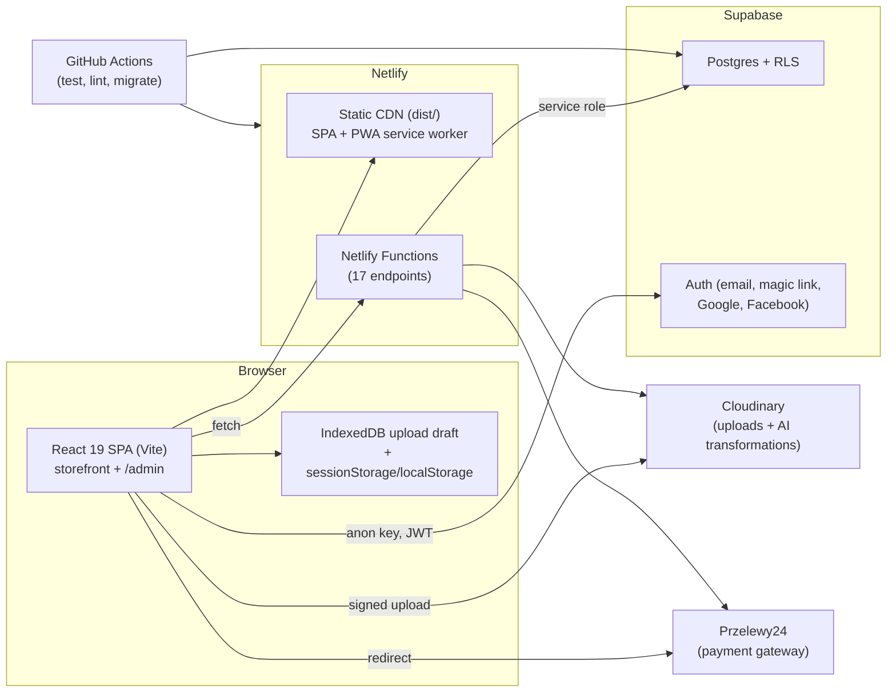

# Tuus Imago — Technical Summary & Ownership Transfer Guide

> Purpose: everything a new owner/developer needs to understand, run, operate, and safely change this application. It covers architecture, external services, configuration/secrets, database, backend, admin panel, customer flow, deployment, and known gaps.
>
> Companion docs: `README.md` (quick start), `docs/image-uploader-preview-regression-notes.md` (preview internals), `src/pages/PRZELEWY24_LEGAL_REQUIREMENTS.md` (payment/legal notes).

---

## 1. What the product is

Tuus Imago is a Polish canvas-print e-commerce app. A customer uploads up to **3 photos**, previews/edits them on a wall background, optionally applies Cloudinary AI effects, picks canvas size + frame/canvas material + shipping, and pays via **Przelewy24**. It also has a partner/referral/coupon/promotion system and a full internal admin panel.

- **Currency:** PLN (all prices).
- **Languages:** UI ships in **Polish**; English translations are compiled but not switchable at runtime (see §16).
- **Guest checkout is intentional and supported** (no account required to buy). Accounts are optional, used for order history and saved addresses.
- **Admin panel** lives at `/admin` on the same deployment, gated by Supabase auth + `profiles.is_admin`.

---

## 2. Architecture at a glance



**Trust model:** the browser only ever holds the Supabase *publishable/anon* key. All privileged database access goes through Netlify Functions using the Supabase **service-role** key (`SUPABASE_SECRET_KEY`). RLS still protects direct client access to a few tables (see §11).

---

## 3. Technology stack

| Layer | Technology |
|---|---|
| Frontend | React 19, TypeScript 5.9, Vite 7, Tailwind CSS 4, shadcn/ui + Radix/Base UI |
| Routing | react-router-dom 7 |
| Admin UI | Refine v5 (`@refinedev/core`, `@refinedev/supabase`, `@refinedev/react-table`) + TanStack Table + Recharts |
| State/persistence | React state + sessionStorage/localStorage + IndexedDB (upload draft) |
| Backend | Netlify Functions (Node runtime, TypeScript) |
| Database/Auth | Supabase (Postgres, Auth, RLS) |
| Images | Cloudinary (signed direct upload, transformations, AI effects) |
| Payments | Przelewy24 (P24 REST API, sandbox + production) |
| i18n | Custom dictionary-based i18n (`en.json` / `pl.json`) |
| PWA | vite-plugin-pwa / Workbox 7 |
| Testing | Vitest 4, Testing Library, jsdom (165 test files) |
| Linting | ESLint 9 flat config, typescript-eslint |
| Package manager | pnpm 11 (`pnpm-lock.yaml`) |
| Node | 22+ (CI pins 22.20.0) |
| Hosting | Netlify |
| CI | GitHub Actions (`.github/workflows/run-checks.yml`) |

Repo: `git@github.com:jpietrzyk/tuus-imago.git` (private). Default branch: `main`.

---

## 4. Repository layout

```
src/
  App.tsx                     # Route split: /admin vs storefront, providers, flow wiring
  main.tsx                    # Bootstrap: diagnostics, draft purge, SW registration
  pages/                      # Storefront routes (landing, upload, checkout, account, legal...)
  components/
    image-uploader/           # Upload + canvas preview/editor system (largest area)
    ui/                       # shadcn/ui primitives
  admin/                      # Refine admin app (providers, layout, pages, lib)
  lib/                        # API clients, pricing, Cloudinary, auth, storage, diagnostics
  locales/                    # i18n dictionaries (en.json, pl.json)
  assets/                     # Backgrounds, favicons
netlify/functions/            # Backend endpoints + _shared helpers
supabase/migrations/          # 34 SQL migrations (schema is defined ONLY here)
scripts/                      # supabase-migrate.sh, apply-migrations.mjs
public/                       # manifest.webmanifest, _headers (CSP), _redirects, icons, sw
docs/                         # This doc + regression notes
vite-content-plugin.ts        # Bakes CMS content pages into the bundle at build time
```

Notable root files: `netlify.toml`, `vite.config.ts`, `vitest.config.ts`, `eslint.config.js`, `.env.example`, `AGENTS.md` (not present in repo despite tool config — treat `README.md` as the source of dev instructions).

---

## 5. External services (ownership transfer checklist)

Transfer/own these accounts. Each is a single point of failure; the new owner must control all of them.

| Service | What it is used for | What to transfer | Notes |
|---|---|---|---|
| **GitHub** (`jpietrzyk/tuus-imago`) | Source, CI | Repo ownership, Actions secrets/vars | CI secrets: `SUPABASE_ACCESS_TOKEN`, `SUPABASE_DB_PASSWORD`; var `SUPABASE_PROJECT_REF` |
| **Netlify** | Hosting, functions, build hook | Site, env vars, build hook URL, domain/DNS | Production env vars contain all secrets |
| **Supabase** | Postgres, Auth, RLS | Project ownership/billing, API keys, DB password, Auth providers | See §11 |
| **Cloudinary** | Image storage + transformations + AI | Account, cloud name, API key/secret, upload preset, named AI template | `VITE_CLOUDINARY_AI_TEMPLATE` optional |
| **Przelewy24** | Payments | Merchant account, merchant/POS IDs, CRC, API key | Production API base `https://secure.przelewy24.pl/api/v1` |
| **Domain + DNS** | Public URL | Registrar/DNS | Required for `SITE_URL`, P24 return/status URLs, Netlify domain |
| **Google / Facebook** | OAuth login (via Supabase) | OAuth app credentials configured inside Supabase Auth | Optional; can be disabled |
| **Email delivery** | Supabase auth emails (confirmation, magic link, reset) | SMTP if custom; else Supabase default | Supabase Auth setting |
| **InPost** | ⚠️ **Not an integration** | — | "InPost Kurier" is only a seeded shipping-method label/price; no API connection |

There is **no external CRM, analytics, or error-monitoring service** currently wired. (HubSpot was removed in migration `202604090001_remove_hubspot_fields.sql`.)

---

## 6. Environment variables & secrets

All variables are documented in `.env.example`. A real `.env` exists locally and is **gitignored** (`*.env`); it has never been committed. Transfer `.env` values through a secure channel, and set production values in **Netlify → Site settings → Environment variables**.

### Frontend (Vite, exposed to the browser — must be safe to publish)

| Variable | Required | Purpose |
|---|---|---|
| `VITE_CLOUDINARY_CLOUD_NAME` | Yes | Cloudinary cloud name |
| `VITE_CLOUDINARY_UPLOAD_PRESET` | Yes | Signed upload preset name |
| `VITE_CLOUDINARY_AI_TEMPLATE` | No | Named Cloudinary transformation for AI preview (without `t_` prefix) |
| `VITE_SHOW_UPLOADER_DEBUG` | No | Debug panel; must be `false`/unset in production |
| `VITE_UPLOAD_DRAFT_MAX_AGE_HOURS` | No | Draft retention hours (default 168 = 7 days) |
| `VITE_SUPABASE_URL` | Yes | Supabase project URL |
| `VITE_SUPABASE_PUBLISHABLE_KEY` | Yes | Supabase anon/publishable key |

### Server-side (Netlify Functions — never expose)

| Variable | Required | Purpose |
|---|---|---|
| `CLOUDINARY_API_KEY` | Yes | Signed-upload signature |
| `CLOUDINARY_API_SECRET` | Yes | Signed-upload signature (secret) |
| `SUPABASE_URL` | Yes | Service-role client |
| `SUPABASE_SECRET_KEY` | Yes | Supabase service-role key |
| `SITE_URL` | Yes | Public site URL (P24 return/status URLs) |
| `P24_MERCHANT_ID` / `P24_POS_ID` / `P24_CRC` / `P24_API_KEY` | Yes | Przelewy24 credentials |
| `P24_API_BASE_URL` | Yes (non-local) | `https://secure.przelewy24.pl/api/v1` in production |
| `P24_ALLOW_SANDBOX` | No | Must be `false`/unset in production |
| `P24_STATUS_URL` | No | Override webhook URL |
| `NETLIFY_BUILD_HOOK_URL` | No | Enables admin "Content → Rebuild" |

### Build/CI-only

| Variable | Where | Purpose |
|---|---|---|
| `SUPABASE_ACCESS_TOKEN` | GitHub secret | `sbp_…` personal access token for migrations |
| `SUPABASE_DB_PASSWORD` | GitHub secret | Postgres password for `supabase db push` |
| `SUPABASE_PROJECT_REF` | GitHub repo variable (or secret) | Supabase project ID |
| `COMMIT_REF` / `GITHUB_SHA` | Netlify/CI auto | Baked into `__APP_VERSION__` |

**Misconfiguration guards already in place:**
- `vite.config.ts` `assertP24ProductionConfig()` **fails a production build** if `P24_API_BASE_URL` is missing or points at sandbox.
- `netlify/functions/_shared/przelewy24.ts` `getP24Config()` **fails closed** at runtime if a non-local site would use the sandbox without `P24_ALLOW_SANDBOX=true`.
- `vite-content-plugin.ts` **fails the build** if it cannot fetch `content_pages` (never silently ships empty legal pages).

---

## 7. Local development

Prerequisites: Node 22+, pnpm, (for payment/upload work) Netlify CLI via `pnpm dev:netlify`.

```bash
pnpm install
cp .env.example .env      # fill in values
pnpm dev                  # Vite only
pnpm dev:netlify          # Full stack incl. Netlify Functions (use for uploads/P24)
pnpm build                # tsc -b && vite build
pnpm preview              # preview production build
pnpm test                 # Vitest (watch; CI runs once)
pnpm lint                 # ESLint
npx tsc -b                # Typecheck (also run by build)
npx vitest run            # Full test suite, non-watch
```

Tests use jsdom with polyfills (`vitest.setup.ts`) for ResizeObserver, canvas 2D context, pointer capture, matchMedia, fake-indexeddb.

---

## 8. Deployment, CI/CD & release

### Netlify
- Functions dir is `netlify/functions` (`netlify.toml`).
- **The build command, publish directory (`dist`), and Node version are configured in the Netlify site settings (UI), not committed in `netlify.toml`.** Capture these as part of the Netlify handover (or migrate them into `netlify.toml`), otherwise the production build cannot be reproduced from the repo alone.
- SPA routing via `public/_redirects` (`/* → /index.html 200`).
- `public/_headers` sets long-lived caching for hashed assets, no-cache for `/index.html` and `/version.json`, and the security header/CSP baseline.
- `netlify.toml` sets `no-cache` for `/sw.js` and revalidation for the manifest.

### GitHub Actions (`.github/workflows/run-checks.yml`)
Runs on every push, three sequential jobs:
1. **test** — `pnpm install --frozen-lockfile` → `pnpm test`
2. **lint** — `pnpm lint` → `npx tsc -b`
3. **migrate** — only on `main` **and** when `supabase/migrations/**` changed → `pnpm db:migrate:deploy` (GitHub `production` environment)

### Build identity & version
- `package.json` version (`0.9.0`) + git short SHA → `__APP_VERSION__` (e.g. `0.9.0+1b61885`).
- `/version.json` is emitted on every build and served no-cache; the running client compares it against its baked version.
- `?build` shows a running-vs-deployed badge with a manual refresh.

---

## 9. Backend — Netlify Functions

All endpoints are under `/.netlify/functions/<name>`. There are no custom routes except the two that opt into Netlify v2 `config` (for rate limits): `create-order` and `cloudinary-signature`.

| Function | Method | Auth | Purpose |
|---|---|---|---|
| `create-order` | POST | Public (guest checkout) | Validates + server-side prices the order, inserts order/items/history, applies coupon + promotion + shipping; **rate-limited 10/60s**; idempotent via `idempotency_key` |
| `create-przelewy24-session` | POST | Public | Registers/reuses a P24 transaction for an order, returns redirect URL; persists payment session fields |
| `przelewy24-webhook` | POST | P24 signature | Verifies notification sign + amount/currency, calls P24 `transaction/verify`, marks order paid (idempotent) |
| `order-status` | GET | Public (UUID) | Polled by checkout after payment return |
| `validate-coupon` | POST | Public | Read-only coupon validation preview |
| `active-promotion` | GET | Public | Current active promotion for header/checkout |
| `app-settings` | GET | Public | DPI guard thresholds (60s cache) |
| `available-frames` | GET | Public | Active frame catalog |
| `available-canvases` | GET | Public | Active canvas catalog |
| `available-shipping` | GET | Public | Active shipping methods + free-shipping thresholds |
| `cloudinary-signature` | POST | Public | Returns signed-upload signature; **rate-limited 20/60s** |
| `track-referral` | POST | Public | Records referral click event; rate-limited via DB limiter |
| `submit-complaint` | POST | Public | Validates + stores a complaint from `/complaint`; rate-limited via DB limiter |
| `customer-orders` | GET | **Bearer JWT** | Authenticated user's orders (scoped by token `user_id`) |
| `customer-addresses` | GET/POST/PATCH/DELETE | **Bearer JWT** | Authenticated user's addresses CRUD (scoped by token) |
| `admin-api` | GET/POST/PATCH/PUT/DELETE | **Bearer JWT + `is_admin`** | Service-role admin gateway (CRUD, aggregates, bulk status, CSV export) |
| `trigger-build` | POST | **Bearer JWT + `is_admin`** | Calls the Netlify build hook to rebuild content |

Shared helpers (`_shared/`):
- `supabase-auth.ts` — `getAuthenticatedUser()` (verifies JWT with publishable key) and `createServiceClient()` (service role).
- `przelewy24.ts` — signing, minor units, auth header, and the **fail-closed** config guard.
- `v2-adapter.ts` — bridges Lambda-style handlers to Netlify v2 `Request`/`Response` so rate limits work.
- `order-access.ts` — generates/verifies the per-order access token (timing-safe) used by the guest payment/status endpoints.
- `rate-limit.ts` — IP-keyed DB-backed throttle helper (`check_rate_limit`) for endpoints that cannot use a native Netlify rule.
- `fetch-all.ts` — pages PostgREST reads with `.range()` so admin aggregates/CSV exports don't truncate at the 1000-row cap.

**Resource governance:** `admin-api` allowlists resources (`orders`, `order_items`, `order_status_history`, `coupons`, `coupon_usages`, `profiles`, `partners`, `partner_refs`, `promotions`, `picture_frames`, `picture_canvases`, `shipping_methods`, `app_settings`, `content_pages`). Any other resource → `400`.

---

## 10. Admin panel (`/admin`)

Mounted separately from the storefront: `App.tsx` branches on `pathname.startsWith("/admin")` and renders a Refine app (`src/admin/AdminApp.tsx`). Pages are `React.lazy` code-split.

### Access control (three layers)
1. **Route guard:** `<Authenticated>` uses `adminAuthProvider.check` — requires a Supabase session **and** `profiles.is_admin === true`, else redirect to `/admin/login`.
2. **Server enforcement:** every `admin-api` / `trigger-build` call re-verifies the Bearer JWT and re-reads `profiles.is_admin` with the service role before acting.
3. **Database defense-in-depth:** since migration `202609180001`, a trigger (`profiles_prevent_admin_self_update`) blocks an authenticated user from changing their own `is_admin` (closes a prior privilege-escalation path). Service-role statements are still allowed so admins can grant/revoke.

Login supports email/password and Google OAuth. No self-signup for admins.

### Sections

| Section | Route | Manages | Key actions |
|---|---|---|---|
| Dashboard | `/admin` | `orders`, `coupons`, `partner_refs` | KPIs, revenue charts (30-day + monthly), status breakdown, recent orders |
| Orders | `/admin/orders` | `orders`, `order_items`, `order_status_history` | Filter, thumbnail list, **bulk status update**, **CSV export**; detail view with status/shipment transition state machines, tracking number, image download, fullscreen preview, history timeline |
| Coupons | `/admin/coupons` | `coupons` | CRUD, % or fixed discount, min order, max uses, validity window, partner attribution, CSV export |
| Promotions | `/admin/promotions` | `promotions` | CRUD; activating one deactivates others (single active promotion) |
| Referral codes | `/admin/refs` | `partner_refs` | Create/delete, QR code dialog (`/?ref=<code>`), copy link, immutable `ref_code` |
| Partners | `/admin/partners` | `partners`, `coupons`, `partner_refs` | CRUD, stats, assign coupons/refs, QR |
| Frames | `/admin/frames` | `picture_frames` | CRUD, activate/default toggles (single default enforced server-side) |
| Canvases | `/admin/canvases` | `picture_canvases` | Same as frames |
| Shipping | `/admin/shipping` | `shipping_methods` | CRUD, price, delivery time, free-shipping threshold, default toggle |
| Customers | `/admin/customers` | aggregate of `orders` | Customer list/detail (order count, revenue, consent, address) |
| Complaints | `/admin/complaints` | `complaints` | Review submissions from `/complaint`; change status (new/in review/resolved/rejected) and internal notes |
| Users | `/admin/users` | `profiles` + Supabase Auth | List non-admins, edit profile, **grant/revoke admin** |
| Admins | `/admin/admins` | `profiles` + Supabase Auth | Same, filtered to admins |
| Settings | `/admin/settings` | `app_settings` | DPI guard on/off + quality thresholds (excellent/good/acceptable) |
| Content | `/admin/content` | `content_pages` | Edit CMS pages (Markdown) and **trigger a site rebuild** via build hook |

### Admin known limitations (see §21 for the full list)
- `promotions` is now a registered Refine resource (list/create/edit/show); `users` / `admins` remain pseudo-resources that use aggregates against `orders`/`profiles`.
- User listing pages through all auth users (no longer capped at 1000).
- Complaint photo attachments are not collected yet (form field is present but the photos are not transmitted; see §21).
- No delete UI for most entities (only referral codes).
- Status updates / exports use full-page reloads, `alert()`, `confirm()`.

---

## 11. Database (Supabase / Postgres)

The schema is defined **only** by the 34 SQL files in `supabase/migrations/`. There are no native enums — all "enums" are `text` + `CHECK`. `pgcrypto` provides `gen_random_uuid()`.

### Tables

| Table | Purpose | RLS |
|---|---|---|
| `orders` | Orders (customer, shipping, totals, coupon/promotion, P24 payment fields, shipment, `user_id`, `ref_code`, `shipping_method_id`) | Enabled, no policies → service-role only |
| `order_items` | Line items (max 3, slots left/center/right), image URLs/transformations, frame + canvas snapshots | service-role only |
| `order_status_history` | Audit trail (`order`/`shipment`/`payment`) | service-role only |
| `profiles` | One per auth user (`full_name`, `phone`, `is_admin`) | Own-row read; own-row update (is_admin blocked by trigger) |
| `addresses` | Saved customer addresses | Owner full CRUD (only end-user-writable table) |
| `coupons` | Coupon codes (% / fixed), validity, usage limits, partner | Public read `is_active = true`; writes service-role |
| `coupon_usages` | Coupon redemption records | service-role only |
| `partners` | B2B partner records | service-role only |
| `partner_refs` | Referral codes per partner | service-role only |
| `referral_events` | Referral click analytics | service-role only |
| `promotions` | Campaign discounts (single active) | Public read `is_active = true` |
| `app_settings` | Key/value runtime settings (DPI seeds) | service-role only; consumed via `app-settings` function |
| `content_pages` | CMS/legal pages baked into the bundle at build | Public read `is_published = true` |
| `complaints` | Complaint submissions from `/complaint` (status + admin notes) | service-role only |
| `rate_limit_hits` | DB-backed throttle buckets for public endpoints | service-role only |
| `picture_frames` | Frame catalog | Public read `is_active = true` |
| `picture_canvases` | Canvas material catalog | Public read `is_active = true` |
| `shipping_methods` | Shipping options + free-shipping threshold | Public read `is_active = true` |

Single-default invariants exist on `picture_frames`, `picture_canvases`, `shipping_methods` via partial unique indexes; `admin-api` clears siblings when one is set default.

### Functions / triggers (highlights)
- `generate_order_number()` — `TI-YYYY-NNNNNN` via `order_number_seq`.
- `handle_new_user()` — creates a `profiles` row on signup.
- `link_guest_orders()` — claims guest orders by email after signup (sets `orders.user_id`).
- `increment_coupon_used_count(uuid)` — SECURITY DEFINER RPC called by `create-order`.
- `prevent_profile_admin_self_update()` — blocks user self-elevation to admin.
- `check_rate_limit(key, limit, window_seconds)` — SECURITY DEFINER DB throttle used by the public endpoints without a native Netlify rule.
- Per-table `updated_at` triggers.
- `202608080002_function_security_hardening.sql` pinned `search_path` and revoked EXECUTE on SECURITY DEFINER functions; `202609190004_pin_trigger_search_path.sql` pins the three later trigger functions (`handle_picture_frame_updated_at`, `handle_picture_canvas_updated_at`, `handle_shipping_method_updated_at`). A guard test now fails if any SQL function is created without a pinned `search_path`.

### Migrations

```bash
# Local/dev
export SUPABASE_PROJECT_REF=... SUPABASE_DB_PASSWORD=... SUPABASE_ACCESS_TOKEN=sbp_...
pnpm db:migrate:dev      # links + supabase db push --linked (falls back to Management SQL API)
# Production: automatic on merge to main when migrations change (CI job)
```

The script first tries the Supabase CLI; if `supabase link` fails (known typed-key `api-keys` schema bug), it falls back to `scripts/apply-migrations.mjs` via the Management SQL API.

---

## 12. Customer flow (step by step)

1. **Entry** — `/` (camera tile) or `/how-it-works` (marketing). URL params are captured on first mount: `?ref=<code>` → 30-day `tuus_ref` cookie; `?code=<coupon>` → sessionStorage auto-apply at checkout. Referral clicks are POSTed to `track-referral`.
2. **Upload / prepare-painting** — `/upload` (select) and `/prepare-painting` (editor) are the **same React element with a fixed key**, so switching between them never remounts and in-progress photos survive. Up to 3 slots. Printability is evaluated in the preview, not at selection.
3. **Checkout availability** — the footer checkout dropup lists orderable (printable) slots with checkboxes. Unprintable slots are force-unchecked and disabled; checkout requires ≥1 printable slot.
4. **Checkout** (`/checkout`) — frame + canvas selection per slot, shipping method, address form, coupon, active promotion, and totals. All UI state is sessionStorage-backed so reloads/OAuth round-trips don't lose the order.
5. **Order creation** — `create-order` recomputes everything server-side (never trusts client prices), inserts order/items/history, applies coupon usage and promotion, resolves shipping.
6. **Payment** — `create-przelewy24-session` registers the transaction and returns a P24 redirect URL. After payment, P24 returns to `/checkout?payment=return&orderId=…`; checkout polls `order-status` every 5s (up to 5 min). The asynchronous `przelewy24-webhook` verifies and marks the order paid.
7. **Account (optional)** — `/account/*` (protected): profile, orders (with status/payment badges, tracking, item thumbnails), saved addresses (full CRUD), payments list. Guest orders are linked to an account on signup by matching email.

**Pricing model** (`src/lib/pricing.ts`): each canvas print unit = **200 PLN** (`CANVAS_PRINT_UNIT_PRICE`), plus per-slot frame price + canvas price, minus coupon and active-promotion discounts, plus shipping. Shipping cost is free above a method's `free_shipping_threshold` (evaluated on pre-discount subtotal).

**Countries:** 31 European countries (`src/lib/checkout-constants.ts`).

---

## 13. Image upload & canvas preview pipeline

1. **Selection & validation** (`src/components/image-uploader/`): JPEG/PNG/WebP, max 10 MB, max 3 images. DPI is deliberately **not** checked at selection. In-app camera via `getUserMedia`; camera/gallery session markers explain an OS-killed picker after reload.
2. **Cloudinary signed upload** (`src/lib/cloudinary-upload.ts`): browser requests a signature from `cloudinary-signature` (SHA-1, secret server-side), then uploads directly to Cloudinary via XHR with progress/abort support. Folder: `tuus-imago`.
3. **Transformations** (`src/lib/image-transformations.ts`): rotation/flip/flip, brightness/contrast/grayscale/blur, manual or auto crop, and AI effects: `e_enhance`, `e_background_removal` (pre-limited to 4900×4900 to stay under Cloudinary's 25 MP limit), `e_upscale`, `e_gen_restore`, plus optional named template.
4. **Preview canvas** (`use-preview-canvas-render.ts`, `use-crop-adjust.ts`, `use-canvas-pan-zoom.ts`): portrait/landscape-aware crop planning, gesture-only pinch/wheel zoom capped at 3× and further limited by DPI headroom, triptych ("panoramka") support splitting one image into three contiguous windows.
5. **DPI / printability** (`image-dpi-calculator.ts`, `image-dpi-rules.ts`, `size-dpi-availability.ts`): computes effective DPI per offered print size, recommends a size, and marks a slot printable/unprintable. Defaults: min 72 DPI, quality excellent 300 / good 150 / acceptable 72. **Remote-configurable** from admin Settings and fetched via `app-settings`. A below-threshold photo is not blocked — it shows a non-blocking "unprintable" notice and cannot be ordered.
6. **Draft persistence** (`src/lib/upload-draft-store.ts`): IndexedDB store `tuus-imago` / `upload-draft` stores photo bytes + editor state, debounced, default 7-day retention (`VITE_UPLOAD_DRAFT_MAX_AGE_HOURS`); purged on app boot. Successful slots also persist in sessionStorage until the order is placed.

---

## 14. Coupons, promotions, partners & referrals

- **Coupons:** public read of active rows; validated app-side by `validate-coupon` (preview) and authoritatively re-checked in `create-order`; usage counted via `increment_coupon_used_count` + `coupon_usages`. Supports `percentage` / `fixed_amount`, min order, max uses, validity window, and partner attribution.
- **Promotions:** at most one active (enforced by admin-api); shown as a header slogan via `active-promotion`, applied at checkout and re-applied server-side. Supports min order and min slots.
- **Partners & referrals:** each partner has referral codes (`partner_refs`). `?ref=<code>` sets a cookie; clicks are recorded in `referral_events`; the code is stored on the order (`orders.ref_code`).
- **Shipping methods:** admin-managed catalog; orders snapshot `shipping_method_id` + delivery time. The seeded default is "InPost Kurier" (14.99 PLN, 1–2 business days); no carrier API.

---

## 15. Backend data flow for orders (authoritative logic)

`create-order.ts` is the single source of truth for money. It validates the customer, country allowlist, required consents, slot count/keys, loads active frames/canvases from the DB, recomputes unit + frame + canvas prices, re-validates the coupon, applies the active promotion, resolves shipping server-side, then inserts `orders`, `order_items`, and two `order_status_history` rows, and increments coupon usage. It is idempotent through a unique `idempotency_key` (duplicate → returns the existing order) and rate-limited to 10 requests/60s per IP+domain. `user_id` is taken only from a verified Bearer JWT (invalid token → 401; no token → guest order); a client-supplied `userId` is ignored. Each order also gets a random `order_access_token`, returned to the client and required by `create-przelewy24-session`/`order-status` for token-bearing orders (legacy orders fall back to UUID-only).

Order lifecycle statuses (application-enforced, not DB constraints):
- `status`: `pending_payment → paid → cancelled/refunded`
- `shipment_status`: `pending_fulfillment → in_transit → delivered`, plus `failed_delivery` / `returned`
- `payment_status`: `pending → registered → verified` (or `failed`)

---

## 16. Internationalization

`src/locales/i18n.ts` + `en.json` / `pl.json`, 14 namespaces. `t(path, params)` resolves dotted keys and `{param}` interpolation. **`currentLanguage` is hard-coded to `'pl'`**; `setLanguage()` is a stub. English is compiled but not selectable in the UI. Checkout passes the language to Przelewy24. To add a language switcher, change `getCurrentLanguage()`/`setLanguage()` and ensure P24 language normalization in `create-przelewy24-session`.

---

## 17. PWA, service worker & version updates

- `vite-plugin-pwa` with `registerType: "autoUpdate"`, hand-written `public/manifest.webmanifest`, Workbox precache, `navigateFallback: /index.html`, and a `CacheFirst` runtime cache for Cloudinary images (200 entries / 30 days / quota purge). `VITE_PWA_DEV=1` enables PWA in dev.
- `registerSW({ immediate: true })` in `main.tsx`; `setupServiceWorkerUpdates` re-checks on focus/visibility/online and every 15 min, reloads once on `controllerchange`, and compares `/version.json` to the running version.
- `forceRefreshIfOutdated()` forces at most one refresh per deployed version per tab session to avoid reload loops; `forceRefreshApp()` unregisters SWs, clears Cache Storage, and reloads.
- **Known limitation:** a client stuck on a pre-fix bundle cannot bootstrap the update logic; those installed PWAs need a one-time manual storage clear / reinstall.

---

## 18. Diagnostics & debug tooling

Deliberately shipped, gated by query param or env:
- `?diag` / `?debug` → PII-sanitized ring-buffer journal (`src/lib/diagnostics-log.ts`, 300 entries, `tuus-imago:diagnostics-log`) with copy/clear UI. Sensitive query keys are redacted.
- `?build` (or `?version`) → running-vs-deployed build badge (`BuildVersionBadge`).
- `VITE_SHOW_UPLOADER_DEBUG=true` → uploader debug panel (`ImageDebugPanel`).
- `VITE_SHOW_DEBUG_PANEL=true` → Cloudinary debug strip on upload.
- `src/production-readiness.guard.test.ts` and `src/pwa.guard.test.ts` enforce config guarantees (no debug leakage, rate limits, v2 exports, no dead env vars, PWA setup).

---

## 19. Security posture

### Controls in place
- Browser never holds privileged keys; service-role operations are server-side only.
- CSP + security headers in `public/_headers` (nosniff, DENY framing, HSTS, strict Referrer-Policy, COOP, `camera=(self)`, `form-action` limited to self + P24).
- Admin gating in three layers, including the `is_admin` self-elevation block.
- P24 webhook authenticity via SHA-384 notification signature + amount/currency verification + `/transaction/verify`; order amount always read from the DB.
- P24 config fails closed for non-local sandbox use, plus a production build-time assertion.
- Server-side price recomputation and order idempotency.
- User-scoped queries in `customer-orders` / `customer-addresses` (IDOR defense).
- Generic server errors in `admin-api` (no DB detail leakage).
- Per-order `order_access_token` binds the guest payment (create session) and order-status endpoints to the buyer; `orders.user_id` is only set from a verified JWT.
- DB-backed rate limiting (`check_rate_limit`) on `validate-coupon`, `create-przelewy24-session`, `order-status`, `track-referral`, and `submit-complaint`, in addition to the native Netlify rules on `create-order`/`cloudinary-signature`.
- `admin-api` validates every caller-supplied select/filter/sort/group/sum column against a per-resource allowlist and clamps `pageSize` to 1–1000.

### Previously reported, now remediated
- ✅ `profiles.is_admin` privilege escalation → fixed by `202609180001_harden_profiles_is_admin.sql`.
- ✅ P24 sandbox fallback risk → fail-closed guard + build assertion.
- ✅ Missing CSP/security headers → added in `public/_headers`.
- ✅ Debug/raw error leakage → stripped, guarded by tests.
- ✅ Rate limiting → native rules on `create-order`/`cloudinary-signature`, plus the DB limiter on the remaining public endpoints.
- ✅ Guest payment/status endpoints gated by order UUID → per-order access token.
- ✅ Unverified `orders.user_id` from the request body → verified JWT only.
- ✅ `admin-api` unvalidated column names → per-resource allowlist + `pageSize` clamp.
- ✅ `search_path` not pinned on three trigger functions → pinned by `202609190004`, enforced by a guard test.
- ✅ Customers CSV export `400` and 1000-row truncation in admin aggregates/exports → export-only resource + paginated reads.

### Open / residual risks (see §21)
- No error monitoring / alerting.
- Verification uses the publishable key, but those functions then query with the service role — safety depends on explicit scoping, which is present today.
- The per-order access token is carried in the P24 return URL query string, so it can appear in browser history/logs (it is scoped to a single order).
- Complaint photos are not collected/validated yet (field is present but not transmitted).


---

## 20. Testing & quality gates

- **165 test files** across `src/`, `netlify/__tests__/`, and page-level tests. Co-located tests act as behavioral documentation.
- Commands: `npx vitest run <file>` (targeted), `npx vitest run` (full), `pnpm test`, `pnpm lint`, `npx tsc -b`.
- Guard tests are important: they fail the suite when security/caching/versioning invariants regress (including a `search_path`-pinning guard).
- Caveat: many admin/backend tests mock `fetch` and Refine hooks, so backend integration gaps (e.g. real PostgREST pagination behavior) are not covered end-to-end.

---

## 21. Known issues, tech debt & recommendations

**Bugs**
- Complaint page photos are not submitted (the file input is present but excluded from the payload) — phase 2.
- Complaint submissions have no e-mail notification; staff must check Admin → Complaints.

**Architecture / maintainability**
- `create-order.ts` (~600 lines), `checkout.tsx` (~2000 lines), `admin-api.ts` (~1400 lines), and `App.tsx` (~1100 lines) are large hotspots.
- `users`/`admins` are pseudo-resources (aggregates), not real backend resources.
- Legacy text shipping fields coexist with new FK-based ones; `202609190005_backfill_order_shipping_method.sql` backfills `shipping_method_id`/delivery time for historical orders, but the legacy columns are still present.
- Duplicated `updated_at` trigger functions across tables.
- Admin CRUD relies almost entirely on the service-role gateway (RLS is bypassed) with per-resource column allowlisting; the gateway remains the whole security boundary.

**Operational**
- No error monitoring or uptime alerting. (Recommended: add Sentry behind `VITE_SENTRY_DSN`/`SENTRY_DSN`, or a `/health` endpoint plus an external uptime checker.)
- Debug surfaces ship in the production bundle (intentional, param-gated) — decide whether to keep.
- Dependency auditing (`pnpm audit`) and `pnpm build` are now in the `lint` CI job; the audit step is `continue-on-error` until advisories are triaged.
- Verify `P24_STATUS_URL` / `SITE_URL` and webhook reachability after any domain change.
- Reconcile `.env` / Netlify env / README if variables are retired. CI-only `CONTENT_ALLOW_EMPTY=true` lets the CI build bake empty content without Supabase credentials; it is ignored when Netlify sets `CONTEXT=production`, so it cannot weaken a deploy build.

**Suggested priority if hardening continues**
1. Add error monitoring / uptime alerting.
2. Add complaint photo attachments (reuse the Cloudinary signed upload) and e-mail notifications.
3. Consider bot protection (e.g. honeypot/Turnstile) on `track-referral` and `submit-complaint` beyond IP throttling.
4. Reduce the large hotspot files in follow-up refactors.
5. Turn the dependency audit into a blocking CI gate once current advisories are cleared.

---

## 22. Operational runbook (common tasks)

| Task | How |
|---|---|
| Change prices (per-unit / frames / canvases / shipping) | Unit price is code (`src/lib/pricing.ts`); frames/canvases/shipping are admin-managed (Admin → Frames/Canvases/Shipping) |
| Enable/disable DPI guard or change thresholds | Admin → Settings (writes `app_settings`; picked up by clients on next load/visibility change) |
| Change legal/company content | Admin → Content (Markdown) → save → **Rebuild** (requires `NETLIFY_BUILD_HOOK_URL`) |
| Issue a coupon | Admin → Coupons; optionally attribute to a partner |
| Run a campaign | Admin → Promotions; activate one (deactivates others) |
| Create partner referral codes / QR | Admin → Partners → Add ref, or Admin → Referral Codes |
| Process orders / shipping | Admin → Orders → detail; set order status and shipment status + tracking number |
| Review complaints | Admin → Complaints → open a submission, set status + internal notes, save |
| Grant admin access | Admin → Users → Grant admin (or Admins list) |
| Apply DB migrations | Merge to `main` with changed `supabase/migrations/**` (CI), or run `pnpm db:migrate:dev` |
| Roll out a new build | Merge/push to `main` → Netlify builds; clients auto-update via `/version.json` + SW |
| Diagnose a stuck client | Open `?build` to compare versions; `?diag` for the journal; if an old pre-fix bundle, clear storage/reinstall the PWA |
| Check deploy build identity | `?build` badge or `/version.json` |

---

## 23. Ownership transfer checklist

- [ ] Transfer **GitHub** repo ownership and set Actions secrets/vars (`SUPABASE_ACCESS_TOKEN`, `SUPABASE_DB_PASSWORD`, `SUPABASE_PROJECT_REF`).
- [ ] Transfer **Netlify** site (or invite as owner) and copy all production env vars via a secure channel.
- [ ] Transfer **Supabase** project (owner/billing) and rotate keys if they were shared; store the DB password, service-role key, and confirm Auth providers (Google/Facebook, email/SMTP).
- [ ] Transfer **Cloudinary** account; confirm cloud name, signed upload preset, API key/secret, and the named AI template.
- [ ] Transfer **Przelewy24** merchant account; confirm production credentials and that `P24_API_BASE_URL` points at production with `P24_ALLOW_SANDBOX` false.
- [ ] Transfer **domain + DNS**; update `SITE_URL`, `P24_STATUS_URL`, Netlify domain, and Supabase Auth redirect URLs.
- [ ] Transfer the local `.env` securely; confirm no secrets are committed (currently clean).
- [ ] Create/confirm the Netlify **build hook** and set `NETLIFY_BUILD_HOOK_URL`.
- [ ] Verify the P24 webhook is reachable and returns success from the live domain.
- [ ] Confirm the new migrations applied: `complaints`, `rate_limit_hits`, `orders.order_access_token`, `shipping_method_id` backfill, and pinned `search_path`.
- [ ] Smoke-test a sandbox checkout: order created, `create-przelewy24-session` accepts the returned access token, P24 return carries `token`, and the status poll succeeds.
- [ ] Run `npx vitest run`, `npx tsc -b`, `pnpm lint`, `pnpm build` on a clean clone to confirm the new owner's environment.
- [ ] Review the open items in §21 and decide ownership/priority.
- [ ] Set up error monitoring (not currently present).

---

## 24. Glossary

- **Slot** — one of up to three photo positions (`left`, `center`, `right`) in an order.
- **Prepare-painting** — the editor route where the photo is cropped/zoomed/AI-adjusted on a wall preview.
- **Triptych / panoramka** — one photo split into three contiguous canvas windows.
- **Printability / DPI guard** — whether a photo has enough resolution to print at a given size; informs and disables (not blocks) ordering.
- **Draft** — the IndexedDB-persisted in-progress upload/editor state, retained ~7 days.
- **Ref** — a partner referral code (`?ref=`), tracked via cookie and `referral_events`.
- **P24** — Przelewy24, the payment gateway.
- **Service role** — Supabase key that bypasses RLS; used only in Netlify Functions.
