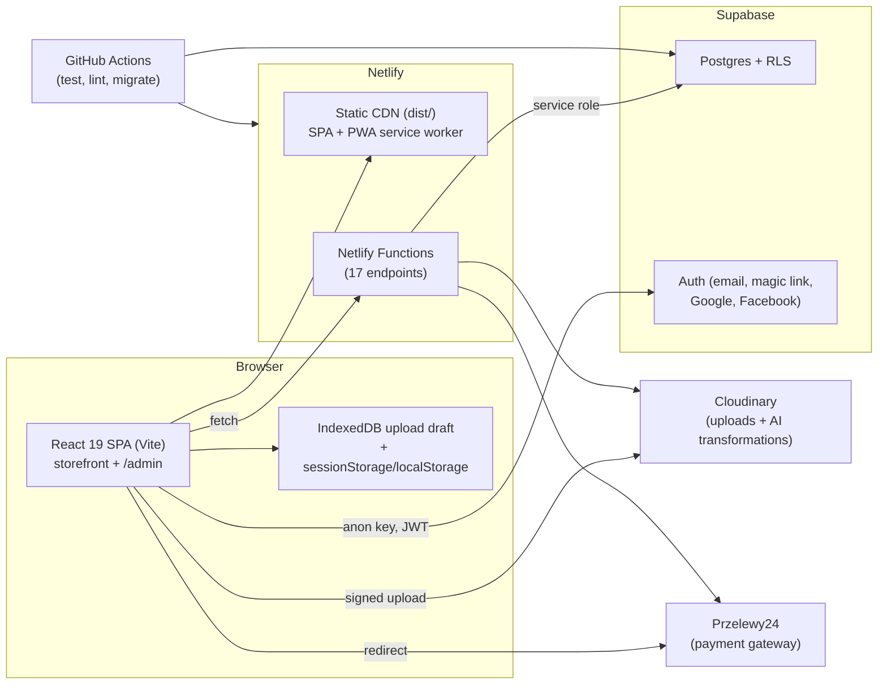

# Tuus Imago — Podsumowanie techniczne i przewodnik przekazania własności

> Cel: wszystko, co nowy właściciel/developer musi wiedzieć, aby zrozumieć, uruchomić, obsługiwać i bezpiecznie zmieniać tę aplikację. Obejmuje architekturę, usługi zewnętrzne, konfigurację/sekretty, bazę danych, backend, panel administracyjny, ścieżkę klienta, wdrożenie oraz znane luki.
>
> Dokumenty towarzyszące: `README.md` (szybki start), `docs/image-uploader-preview-regression-notes.md` (wnętrze podglądu), `src/pages/PRZELEWY24_LEGAL_REQUIREMENTS.md` (uwagi o płatnościach/ prawie).

---

## 1. Czym jest produkt

Tuus Imago to polska aplikacja e-commerce sprzedająca wydruki na płótnie. Klient wgrywa do **3 zdjęć**, wyświetla je i edytuje na tle ściany, opcjonalnie stosuje efekty AI Cloudinary, wybiera rozmiar płótna + ramę/materiał płótna + dostawę i płaci przez **Przelewy24**. Aplikacja ma także system partnerów/referencji/kuponów/promocji oraz pełny wewnętrzny panel administracyjny.

- **Waluta:** PLN (wszystkie ceny).
- **Języki:** interfejs jest dostarczany po **polsku**; angielskie tłumaczenia są skompilowane, ale nieprzełączalne w czasie działania (zob. §16).
- **Zamówienie bez konta (guest checkout) jest celowe i wspierane** (zakup bez konta). Konta są opcjonalne, służą do historii zamówień i zapisanych adresów.
- **Panel administracyjny** znajduje się pod `/admin` na tym samym wdrożeniu, chroniony przez uwierzytelnianie Supabase + `profiles.is_admin`.

---

## 2. Architektura w skrócie



**Model zaufania:** przeglądarka przechowuje wyłącznie *publishable/anon* klucz Supabase. Cały uprzywilejowany dostęp do bazy danych odbywa się przez Netlify Functions z użyciem klucza **service-role** Supabase (`SUPABASE_SECRET_KEY`). RLS nadal chroni bezpośredni dostęp klienta do kilku tabel (zob. §11).

---

## 3. Stos technologiczny

| Warstwa | Technologia |
|---|---|
| Frontend | React 19, TypeScript 5.9, Vite 7, Tailwind CSS 4, shadcn/ui + Radix/Base UI |
| Routing | react-router-dom 7 |
| UI administracyjne | Refine v5 (`@refinedev/core`, `@refinedev/supabase`, `@refinedev/react-table`) + TanStack Table + Recharts |
| Stan/trwałość | Stan React + sessionStorage/localStorage + IndexedDB (szkic wgrywania) |
| Backend | Netlify Functions (środowisko Node, TypeScript) |
| Baza/Auth | Supabase (Postgres, Auth, RLS) |
| Obrazy | Cloudinary (podpisane bezpośrednie wgrywanie, transformacje, efekty AI) |
| Płatności | Przelewy24 (P24 REST API, sandbox + produkcja) |
| i18n | Własne i18n słownikowe (`en.json` / `pl.json`) |
| PWA | vite-plugin-pwa / Workbox 7 |
| Testy | Vitest 4, Testing Library, jsdom (165 plików testów) |
| Lintowanie | ESLint 9 flat config, typescript-eslint |
| Menedżer pakietów | pnpm 11 (`pnpm-lock.yaml`) |
| Node | 22+ (CI przypina 22.20.0) |
| Hosting | Netlify |
| CI | GitHub Actions (`.github/workflows/run-checks.yml`) |

Repozytorium: `git@github.com:jpietrzyk/tuus-imago.git` (prywatne). Domyślna gałąź: `main`.

---

## 4. Układ repozytorium

```
src/
  App.tsx                     # Route split: /admin vs storefront, providers, flow wiring
  main.tsx                    # Bootstrap: diagnostics, draft purge, SW registration
  pages/                      # Storefront routes (landing, upload, checkout, account, legal...)
  components/
    image-uploader/           # Upload + canvas preview/editor system (largest area)
    ui/                       # shadcn/ui primitives
  admin/                      # Refine admin app (providers, layout, pages, lib)
  lib/                        # API clients, pricing, Cloudinary, auth, storage, diagnostics
  locales/                    # i18n dictionaries (en.json, pl.json)
  assets/                     # Backgrounds, favicons
netlify/functions/            # Backend endpoints + _shared helpers
supabase/migrations/          # 34 SQL migrations (schema is defined ONLY here)
scripts/                      # supabase-migrate.sh, apply-migrations.mjs
public/                       # manifest.webmanifest, _headers (CSP), _redirects, icons, sw
docs/                         # This doc + regression notes
vite-content-plugin.ts        # Bakes CMS content pages into the bundle at build time
```

Istotne pliki w katalogu głównym: `netlify.toml`, `vite.config.ts`, `vitest.config.ts`, `eslint.config.js`, `.env.example`, `AGENTS.md` (nieobecny w repo mimo konfiguracji narzędzi — źródłem instrukcji deweloperskich jest `README.md`).

---

## 5. Usługi zewnętrzne (lista kontrolna przekazania własności)

Przekaż/posiadaj te konta. Każde jest pojedynczym punktem awarii; nowy właściciel musi kontrolować wszystkie.

| Usługa | Do czego służy | Co przekazać | Uwagi |
|---|---|---|---|
| **GitHub** (`jpietrzyk/tuus-imago`) | Kod źródłowy, CI | Własność repo, sekrety/zmienne Actions | Sekrety CI: `SUPABASE_ACCESS_TOKEN`, `SUPABASE_DB_PASSWORD`; zmienna `SUPABASE_PROJECT_REF` |
| **Netlify** | Hosting, funkcje, build hook | Strona, zmienne środowiskowe, URL build hooka, domena/DNS | Zmienne produkcyjne zawierają wszystkie sekrety |
| **Supabase** | Postgres, Auth, RLS | Własność/rozliczenia projektu, klucze API, hasło DB, dostawcy Auth | Zob. §11 |
| **Cloudinary** | Przechowywanie obrazów + transformacje + AI | Konto, cloud name, klucz/sekret API, upload preset, nazwany szablon AI | `VITE_CLOUDINARY_AI_TEMPLATE` opcjonalne |
| **Przelewy24** | Płatności | Konto merchant, ID merchant/POS, CRC, klucz API | Bazowy URL API produkcyjnego: `https://secure.przelewy24.pl/api/v1` |
| **Domena + DNS** | Publiczny URL | Rejestrator/DNS | Wymagane dla `SITE_URL`, URL-i zwrotu/statusu P24, domeny Netlify |
| **Google / Facebook** | Logowanie OAuth (przez Supabase) | Poświadczenia aplikacji OAuth skonfigurowane w Supabase Auth | Opcjonalne; można wyłączyć |
| **Dostarczanie e-maili** | E-maile auth Supabase (potwierdzenie, magic link, reset) | SMTP, jeśli własny; inaczej domyślny Supabase | Ustawienie Supabase Auth |
| **InPost** | ⚠️ **Brak integracji** | — | „InPost Kurier" to jedynie zasiana etykieta/metoda dostawy; brak połączenia API |

Obecnie **nie ma podłączonego zewnętrznego CRM, analityki ani monitoringu błędów**. (HubSpot został usunięty w migracji `202604090001_remove_hubspot_fields.sql`.)

---

## 6. Zmienne środowiskowe i sekrety

Wszystkie zmienne są udokumentowane w `.env.example`. Rzeczywisty plik `.env` istnieje lokalnie i jest **ignorowany przez git** (`*.env`); nigdy nie został zacommitowany. Przekazuj wartości `.env` bezpiecznym kanałem, a wartości produkcyjne ustaw w **Netlify → Site settings → Environment variables**.

### Frontend (Vite, eksponowane do przeglądarki — muszą być bezpieczne do publikacji)

| Zmienna | Wymagana | Cel |
|---|---|---|
| `VITE_CLOUDINARY_CLOUD_NAME` | Tak | Cloud name Cloudinary |
| `VITE_CLOUDINARY_UPLOAD_PRESET` | Tak | Nazwa podpisanego upload presetu |
| `VITE_CLOUDINARY_AI_TEMPLATE` | Nie | Nazwana transformacja Cloudinary dla podglądu AI (bez prefiksu `t_`) |
| `VITE_SHOW_UPLOADER_DEBUG` | Nie | Panel debugowania; w produkcji musi być `false`/nieustawiony |
| `VITE_UPLOAD_DRAFT_MAX_AGE_HOURS` | Nie | Liczba godzin przechowywania szkicu (domyślnie 168 = 7 dni) |
| `VITE_SUPABASE_URL` | Tak | URL projektu Supabase |
| `VITE_SUPABASE_PUBLISHABLE_KEY` | Tak | Klucz anon/publishable Supabase |

### Po stronie serwera (Netlify Functions — nigdy nie ujawniać)

| Zmienna | Wymagana | Cel |
|---|---|---|
| `CLOUDINARY_API_KEY` | Tak | Podpis podpisanego wgrywania |
| `CLOUDINARY_API_SECRET` | Tak | Podpis podpisanego wgrywania (sekret) |
| `SUPABASE_URL` | Tak | Klient service-role |
| `SUPABASE_SECRET_KEY` | Tak | Klucz service-role Supabase |
| `SITE_URL` | Tak | Publiczny URL strony (URL-e zwrotu/statusu P24) |
| `P24_MERCHANT_ID` / `P24_POS_ID` / `P24_CRC` / `P24_API_KEY` | Tak | Poświadczenia Przelewy24 |
| `P24_API_BASE_URL` | Tak (poza lokalnym) | `https://secure.przelewy24.pl/api/v1` w produkcji |
| `P24_ALLOW_SANDBOX` | Nie | W produkcji musi być `false`/nieustawiony |
| `P24_STATUS_URL` | Nie | Nadpisanie URL-a webhooka |
| `NETLIFY_BUILD_HOOK_URL` | Nie | Włącza w panelu admina „Content → Rebuild" |

### Tylko build/CI

| Zmienna | Gdzie | Cel |
|---|---|---|
| `SUPABASE_ACCESS_TOKEN` | Sekret GitHub | Token osobisty `sbp_…` do migracji |
| `SUPABASE_DB_PASSWORD` | Sekret GitHub | Hasło Postgres dla `supabase db push` |
| `SUPABASE_PROJECT_REF` | Zmienna (lub sekret) repo GitHub | ID projektu Supabase |
| `COMMIT_REF` / `GITHUB_SHA` | Automatycznie Netlify/CI | Wbudowywane w `__APP_VERSION__` |

**Zabezpieczenia przed błędną konfiguracją, już obecne:**
- `vite.config.ts` `assertP24ProductionConfig()` **przerywa build produkcyjny**, jeśli `P24_API_BASE_URL` brakuje lub wskazuje na sandbox.
- `netlify/functions/_shared/przelewy24.ts` `getP24Config()` **zamyka się bezpiecznie** w czasie działania, jeśli nie-lokalna witryna miałaby używać sandbox bez `P24_ALLOW_SANDBOX=true`.
- `vite-content-plugin.ts` **przerywa build**, jeśli nie może pobrać `content_pages` (nigdy nie wysyła po cichu pustych stron prawnych).

---

## 7. Praca lokalna

Wymagania wstępne: Node 22+, pnpm, (dla pracy nad płatnościami/wgrywaniem) Netlify CLI przez `pnpm dev:netlify`.

```bash
pnpm install
cp .env.example .env      # fill in values
pnpm dev                  # Vite only
pnpm dev:netlify          # Full stack incl. Netlify Functions (use for uploads/P24)
pnpm build                # tsc -b && vite build
pnpm preview              # preview production build
pnpm test                 # Vitest (watch; CI runs once)
pnpm lint                 # ESLint
npx tsc -b                # Typecheck (also run by build)
npx vitest run            # Full test suite, non-watch
```

Testy używają jsdom z polyfillami (`vitest.setup.ts`) dla ResizeObserver, kontekstu 2D canvas, przechwytywania wskaźnika, matchMedia, fake-indexeddb.

---

## 8. Wdrożenie, CI/CD i wydania

### Netlify
- Katalog funkcji to `netlify/functions` (`netlify.toml`).
- **Polecenie build, katalog publikacji (`dist`) i wersja Node są skonfigurowane w ustawieniach witryny Netlify (UI), a nie zacommitowane w `netlify.toml`.** Przejmij je w ramach przekazania Netlify (albo przenieś do `netlify.toml`), inaczej build produkcyjny nie będzie odtwarzalny wyłącznie z repozytorium.
- Routing SPA przez `public/_redirects` (`/* → /index.html 200`).
- `public/_headers` ustawia długotrwałe cache'owanie dla hashowanych assetów, brak cache dla `/index.html` i `/version.json` oraz bazową linię nagłówków bezpieczeństwa/CSP.
- `netlify.toml` ustawia `no-cache` dla `/sw.js` i rewalidację dla manifestu.

### GitHub Actions (`.github/workflows/run-checks.yml`)
Uruchamiane przy każdym pushu, trzy sekwencyjne zadania:
1. **test** — `pnpm install --frozen-lockfile` → `pnpm test`
2. **lint** — `pnpm lint` → `npx tsc -b`
3. **migrate** — tylko na `main` **i** gdy zmieniło się `supabase/migrations/**` → `pnpm db:migrate:deploy` (środowisko GitHub `production`)

### Tożsamość i wersja build
- Wersja z `package.json` (`0.9.0`) + krótki SHA gita → `__APP_VERSION__` (np. `0.9.0+1b61885`).
- `/version.json` jest emitowany przy każdym buildzie i serwowany bez cache; działający klient porównuje go z wbudowaną wersją.
- `?build` pokazuje plakietkę uruchomionej vs wdrożonej wersji z ręcznym odświeżaniem.

---

## 9. Backend — Netlify Functions

Wszystkie endpointy znajdują się pod `/.netlify/functions/<name>`. Nie ma niestandardowych tras poza dwiema, które włączają Netlify v2 `config` (dla limitów szybkości): `create-order` i `cloudinary-signature`.

| Funkcja | Metoda | Auth | Cel |
|---|---|---|---|
| `create-order` | POST | Publiczna (guest checkout) | Waliduje + wycenia zamówienie po stronie serwera, wstawia zamówienie/pozycje/historię, stosuje kupon + promocję + dostawę; **limit 10/60 s**; idempotentna przez `idempotency_key` |
| `create-przelewy24-session` | POST | Publiczna | Rejestruje/ponownie używa transakcji P24 dla zamówienia, zwraca URL przekierowania; zapisuje pola sesji płatności |
| `przelewy24-webhook` | POST | Podpis P24 | Weryfikuje podpis powiadomienia + kwotę/walutę, wywołuje P24 `transaction/verify`, oznacza zamówienie jako opłacone (idempotentnie) |
| `order-status` | GET | Publiczna (UUID) | Odpytywana przez checkout po powrocie z płatności |
| `validate-coupon` | POST | Publiczna | Podgląd walidacji kuponu tylko do odczytu |
| `active-promotion` | GET | Publiczna | Bieżąca aktywna promocja dla nagłówka/checkout |
| `app-settings` | GET | Publiczna | Progi DPI guard (cache 60 s) |
| `available-frames` | GET | Publiczna | Katalog aktywnych ram |
| `available-canvases` | GET | Publiczna | Katalog aktywnych płócien |
| `available-shipping` | GET | Publiczna | Aktywne metody dostawy + progi darmowej dostawy |
| `cloudinary-signature` | POST | Publiczna | Zwraca podpis podpisanego wgrywania; **limit 20/60 s** |
| `track-referral` | POST | Publiczna | Zapisuje zdarzenie kliknięcia referencyjnego; limit przez limiter DB |
| `submit-complaint` | POST | Publiczna | Waliduje + zapisuje reklamację z `/complaint`; limit przez limiter DB |
| `customer-orders` | GET | **Bearer JWT** | Zamówienia uwierzytelnionego użytkownika (zakres przez `user_id` z tokenu) |
| `customer-addresses` | GET/POST/PATCH/DELETE | **Bearer JWT** | CRUD adresów uwierzytelnionego użytkownika (zakres przez token) |
| `admin-api` | GET/POST/PATCH/PUT/DELETE | **Bearer JWT + `is_admin`** | Bramka administracyjna service-role (CRUD, agregaty, masowe statusy, eksport CSV) |
| `trigger-build` | POST | **Bearer JWT + `is_admin`** | Wywołuje build hook Netlify, aby przebudować treści |

Wspólne helpery (`_shared/`):
- `supabase-auth.ts` — `getAuthenticatedUser()` (weryfikuje JWT kluczem publishable) oraz `createServiceClient()` (service role).
- `przelewy24.ts` — podpisywanie, jednostki minor, nagłówek auth i **fail-closed** guard konfiguracji.
- `v2-adapter.ts` — mostek między handlerami w stylu Lambda a Netlify v2 `Request`/`Response`, aby limity szybkości działały.
- `order-access.ts` — generuje/weryfikuje token dostępu do zamówienia (porównanie odporne na atak czasowy) używany przez publiczne endpointy płatności/statusu.
- `rate-limit.ts` — helper limitu opartego o bazę (`check_rate_limit`), kluczowany po IP, dla endpointów bez natywnej reguły Netlify.
- `fetch-all.ts` — stronicuje odczyty PostgREST przez `.range()`, aby agregaty/eksporty CSV admina nie ucinały się na limicie 1000 wierszy.

**Zarządzanie zasobami:** `admin-api` prowadzi allowlistę zasobów (`orders`, `order_items`, `order_status_history`, `coupons`, `coupon_usages`, `profiles`, `partners`, `partner_refs`, `promotions`, `picture_frames`, `picture_canvases`, `shipping_methods`, `app_settings`, `content_pages`, `complaints`). Każdy inny zasób → `400`, z wyjątkiem `customers` (używanego wyłącznie do eksportu CSV). Kolumny w `select`/filtrach/sortowaniu/`groupBy`/`sum` są walidowane względem allowlisty per zasób, a `pageSize` jest ograniczany do 1–1000.

---

## 10. Panel administracyjny (`/admin`)

Montowany osobno od storefrontu: `App.tsx` rozgałęzia się na `pathname.startsWith("/admin")` i renderuje aplikację Refine (`src/admin/AdminApp.tsx`). Strony są dzielone kodem przez `React.lazy`.

### Kontrola dostępu (trzy warstwy)
1. **Strażnik trasy:** `<Authenticated>` używa `adminAuthProvider.check` — wymaga sesji Supabase **i** `profiles.is_admin === true`, inaczej przekierowuje do `/admin/login`.
2. **Egzekwowanie na serwerze:** każde wywołanie `admin-api` / `trigger-build` ponownie weryfikuje Bearer JWT i ponownie odczytuje `profiles.is_admin` z użyciem service role przed działaniem.
3. **Ochrona na poziomie bazy:** od migracji `202609180001` trigger (`profiles_prevent_admin_self_update`) blokuje uwierzytelnionemu użytkownikowi zmianę własnego `is_admin` (zamyka wcześniejszą ścieżkę eskalacji uprawnień). Instrukcje service-role są nadal dozwolone, więc admini mogą nadawać/odbierać uprawnienia.

Logowanie obsługuje e-mail/hasło oraz Google OAuth. Brak samodzielnej rejestracji adminów.

### Sekcje

| Sekcja | Trasa | Zarządza | Kluczowe akcje |
|---|---|---|---|
| Dashboard | `/admin` | `orders`, `coupons`, `partner_refs` | KPI, wykresy przychodów (30 dni + miesięczne), podział statusów, ostatnie zamówienia |
| Orders | `/admin/orders` | `orders`, `order_items`, `order_status_history` | Filtrowanie, lista miniatur, **masowa zmiana statusu**, **eksport CSV**; widok szczegółów z maszynami stanów statusu/dostawy, numer śledzenia, pobieranie obrazów, podgląd pełnoekranowy, oś czasu historii |
| Coupons | `/admin/coupons` | `coupons` | CRUD, rabat % lub kwotowy, min. zamówienie, maks. użyć, okno ważności, przypisanie partnera, eksport CSV |
| Promotions | `/admin/promotions` | `promotions` | CRUD; aktywacja jednej dezaktywuje pozostałe (pojedyncza aktywna promocja) |
| Referral codes | `/admin/refs` | `partner_refs` | Tworzenie/usuwanie, okno dialogowe kodu QR (`/?ref=<code>`), kopiowanie linku, niezmienny `ref_code` |
| Partners | `/admin/partners` | `partners`, `coupons`, `partner_refs` | CRUD, statystyki, przypisywanie kuponów/kodów ref, QR |
| Frames | `/admin/frames` | `picture_frames` | CRUD, przełączniki aktywacji/domyślności (pojedyncza domyślna wymuszana po stronie serwera) |
| Canvases | `/admin/canvases` | `picture_canvases` | To samo co ramy |
| Shipping | `/admin/shipping` | `shipping_methods` | CRUD, cena, czas dostawy, próg darmowej dostawy, przełącznik domyślności |
| Customers | `/admin/customers` | agregat `orders` | Lista/szczegóły klienta (liczba zamówień, przychód, zgody, adres) |
| Complaints | `/admin/complaints` | `complaints` | Przegląd zgłoszeń z `/complaint`; zmiana statusu (new/in review/resolved/rejected) i notatek wewnętrznych |
| Users | `/admin/users` | `profiles` + Supabase Auth | Lista nie-adminów, edycja profilu, **nadawanie/odbieranie admina** |
| Admins | `/admin/admins` | `profiles` + Supabase Auth | To samo, filtrowane do adminów |
| Settings | `/admin/settings` | `app_settings` | DPI guard wł./wył. + progi jakości (excellent/good/acceptable) |
| Content | `/admin/content` | `content_pages` | Edycja stron CMS (Markdown) i **wywołanie przebudowy** witryny przez build hook |

### Znane ograniczenia panelu admina (pełna lista w §21)
- `promotions` jest teraz zarejestrowane jako zasób Refine (list/create/edit/show); `users` / `admins` pozostają pseudo-zasobami korzystającymi z agregatów `orders`/`profiles`.
- Listowanie użytkowników przechodzi przez wszystkich użytkowników auth (już nie ogranicza się do 1000).
- Załączniki zdjęciowe reklamacji nie są jeszcze zbierane (pole formularza istnieje, ale zdjęcia nie są przesyłane; zob. §21).
- Brak UI usuwania dla większości encji (tylko kody referencyjne).
- Zmiany statusów / eksporty powodują pełne przeładowanie strony, `alert()`, `confirm()`.

---

## 11. Baza danych (Supabase / Postgres)

Schemat jest zdefiniowany **wyłącznie** przez 34 pliki SQL w `supabase/migrations/`. Nie ma natywnych enumów — wszystkie „enumy" to `text` + `CHECK`. `pgcrypto` dostarcza `gen_random_uuid()`.

### Tabele

| Tabela | Cel | RLS |
|---|---|---|
| `orders` | Zamówienia (klient, dostawa, sumy, kupon/promocja, pola płatności P24, wysyłka, `user_id`, `ref_code`, `shipping_method_id`) | Włączone, brak polityk → tylko service-role |
| `order_items` | Pozycje (maks. 3, sloty left/center/right), URL-e/transformacje obrazów, snapshoty ramy + płótna | tylko service-role |
| `order_status_history` | Ścieżka audytu (`order`/`shipment`/`payment`) | tylko service-role |
| `profiles` | Po jednym na użytkownika auth (`full_name`, `phone`, `is_admin`) | Odczyt własnego wiersza; zapis własnego wiersza (is_admin blokowany triggerem) |
| `addresses` | Zapisane adresy klientów | Pełny CRUD właściciela (jedyna tabela zapisywalna przez użytkownika końcowego) |
| `coupons` | Kody kuponów (% / kwotowe), ważność, limity użycia, partner | Publiczny odczyt `is_active = true`; zapisy service-role |
| `coupon_usages` | Rekordy wykorzystania kuponów | tylko service-role |
| `partners` | Rekordy partnerów B2B | tylko service-role |
| `partner_refs` | Kody referencyjne per partner | tylko service-role |
| `referral_events` | Analityka kliknięć referencyjnych | tylko service-role |
| `promotions` | Rabaty kampanii (pojedyncza aktywna) | Publiczny odczyt `is_active = true` |
| `app_settings` | Ustawienia runtime klucz/wartość (ziarna DPI) | tylko service-role; konsumowane przez funkcję `app-settings` |
| `content_pages` | Strony CMS/prawne wbudowywane w bundle przy buildzie | Publiczny odczyt `is_published = true` |
| `complaints` | Zgłoszenia reklamacji z `/complaint` (status + notatki admina) | tylko service-role |
| `rate_limit_hits` | Kubły limitu szybkości opartego o bazę dla publicznych endpointów | tylko service-role |
| `picture_frames` | Katalog ram | Publiczny odczyt `is_active = true` |
| `picture_canvases` | Katalog materiałów płótna | Publiczny odczyt `is_active = true` |
| `shipping_methods` | Opcje dostawy + próg darmowej dostawy | Publiczny odczyt `is_active = true` |

Niezmienniki pojedynczej domyślnej wartości istnieją dla `picture_frames`, `picture_canvases`, `shipping_methods` przez częściowe unikalne indeksy; `admin-api` czyści sąsiednie wiersze, gdy któryś ustawia jako domyślny.

### Funkcje / triggery (najważniejsze)
- `generate_order_number()` — `TI-YYYY-NNNNNN` przez `order_number_seq`.
- `handle_new_user()` — tworzy wiersz `profiles` przy rejestracji.
- `link_guest_orders()` — przypisuje zamówienia gości po e-mailu po rejestracji (ustawia `orders.user_id`).
- `increment_coupon_used_count(uuid)` — RPC SECURITY DEFINER wywoływane przez `create-order`.
- `prevent_profile_admin_self_update()` — blokuje samodzielną eskalację użytkownika do admina.
- `check_rate_limit(key, limit, window_seconds)` — SECURITY DEFINER; limit szybkości w bazie dla publicznych endpointów bez natywnej reguły Netlify.
- Triggery `updated_at` per tabela.
- `202608080002_function_security_hardening.sql` przypiął `search_path` i odebrał EXECUTE funkcjom SECURITY DEFINER; `202609190004_pin_trigger_search_path.sql` przypina trzy późniejsze funkcje triggerowe (`handle_picture_frame_updated_at`, `handle_picture_canvas_updated_at`, `handle_shipping_method_updated_at`). Test-strażnik pilnuje teraz, aby żadna funkcja SQL nie została utworzona bez przypiętego `search_path`.

### Migracje

```bash
# Local/dev
export SUPABASE_PROJECT_REF=... SUPABASE_DB_PASSWORD=... SUPABASE_ACCESS_TOKEN=sbp_...
pnpm db:migrate:dev      # links + supabase db push --linked (falls back to Management SQL API)
# Production: automatic on merge to main when migrations change (CI job)
```

Skrypt najpierw próbuje Supabase CLI; jeśli `supabase link` zawiedzie (znany błąd schematu `api-keys`), przełącza się na `scripts/apply-migrations.mjs` przez Management SQL API.

---

## 12. Ścieżka klienta (krok po kroku)

1. **Wejście** — `/` (kafelek kamery) lub `/how-it-works` (marketing). Parametry URL są przechwytywane przy pierwszym montowaniu: `?ref=<code>` → 30-dniowe ciastko `tuus_ref`; `?code=<coupon>` → automatyczne zastosowanie z sessionStorage przy checkout. Kliknięcia referencyjne są wysyłane POST-em do `track-referral`.
2. **Upload / prepare-painting** — `/upload` (wybór) i `/prepare-painting` (edytor) to **ten sam element React ze stałym key**, więc przełączanie między nimi nigdy nie remontuje komponentu, a zdjęcia w toku przetrwają. Maks. 3 sloty. Drukowalność jest oceniana w podglądzie, nie przy wyborze.
3. **Dostępność checkout** — dropup w stopce wymienia sloty możliwe do zamówienia (drukowalne) z checkboxami. Niedrukowalne slotu są wymuszenie odznaczone i wyłączone; checkout wymaga ≥1 drukowalnego slotu.
4. **Checkout** (`/checkout`) — wybór ramy + płótna per slot, metoda dostawy, formularz adresu, kupon, aktywna promocja i sumy. Cały stan UI jest oparty na sessionStorage, więc przeładowania/rundy OAuth nie gubią zamówienia.
5. **Utworzenie zamówienia** — `create-order` przelicza wszystko po stronie serwera (nigdy nie ufa cenom klienta), wstawia zamówienie/pozycje/historię, stosuje użycie kuponu i promocję, rozwiązuje dostawę.
6. **Płatność** — `create-przelewy24-session` rejestruje transakcję i zwraca URL przekierowania P24. Po płatności P24 wraca do `/checkout?payment=return&orderId=…`; checkout odpytuje `order-status` co 5 s (do 5 min). Asynchroniczny `przelewy24-webhook` weryfikuje i oznacza zamówienie jako opłacone.
7. **Konto (opcjonalne)** — `/account/*` (chronione): profil, zamówienia (z plakietkami statusu/płatności, śledzeniem, miniaturami pozycji), zapisane adresy (pełny CRUD), lista płatności. Zamówienia gości są przypisywane do konta przy rejestracji przez dopasowanie e-maila.

**Model cenowy** (`src/lib/pricing.ts`): każda jednostka wydruku na płótnie = **200 PLN** (`CANVAS_PRINT_UNIT_PRICE`), plus cena ramy + cena płótna per slot, minus rabat kuponu i aktywnej promocji, plus dostawa. Koszt dostawy jest darmowy powyżej `free_shipping_threshold` metody (oceniane na sumie przed rabatem).

**Kraje:** 31 krajów europejskich (`src/lib/checkout-constants.ts`).

---

## 13. Wgrywanie obrazów i potok podglądu canvas

1. **Wybór i walidacja** (`src/components/image-uploader/`): JPEG/PNG/WebP, maks. 10 MB, maks. 3 obrazy. DPI celowo **nie** jest sprawdzane przy wyborze. Kamera w aplikacji przez `getUserMedia`; znaczniki sesji kamery/galerii wyjaśniają ubicie pickera przez OS po przeładowaniu.
2. **Podpisane wgrywanie Cloudinary** (`src/lib/cloudinary-upload.ts`): przeglądarka prosi o podpis z `cloudinary-signature` (SHA-1, sekret po stronie serwera), następnie wgrywa bezpośrednio do Cloudinary przez XHR z obsługą postępu/anulowania. Folder: `tuus-imago`.
3. **Transformacje** (`src/lib/image-transformations.ts`): obrót/flip, jasność/kontrast/skala szarości/rozmycie, ręczny lub automatyczny kadr oraz efekty AI: `e_enhance`, `e_background_removal` (wstępnie ograniczone do 4900×4900, aby pozostać poniżej limitu 25 MP Cloudinary), `e_upscale`, `e_gen_restore`, plus opcjonalny nazwany szablon.
4. **Canvas podglądu** (`use-preview-canvas-render.ts`, `use-crop-adjust.ts`, `use-canvas-pan-zoom.ts`): planowanie kadru zależne od orientacji pion/poziom, zoom gestami (pinch/kółko) ograniczony do 3× i dodatkowo limitowany zapasem DPI, obsługa tryptyku („panoramka") dzielącego jeden obraz na trzy sąsiadujące okna.
5. **DPI / drukowalność** (`image-dpi-calculator.ts`, `image-dpi-rules.ts`, `size-dpi-availability.ts`): oblicza efektywne DPI na oferowany rozmiar wydruku, rekomenduje rozmiar i oznacza slot jako drukowalny/niedrukowalny. Domyślnie: min 72 DPI, jakość excellent 300 / good 150 / acceptable 72. **Konfigurowalne zdalnie** z panelu admina Settings i pobierane przez `app-settings`. Zdjęcie poniżej progu nie jest blokowane — pokazuje nieblokujące ostrzeżenie „unprintable" i nie może zostać zamówione.
6. **Trwałość szkicu** (`src/lib/upload-draft-store.ts`): store IndexedDB `tuus-imago` / `upload-draft` przechowuje bajty zdjęć + stan edytora, z debounce, domyślna retencja 7 dni (`VITE_UPLOAD_DRAFT_MAX_AGE_HOURS`); czyszczone przy starcie aplikacji. Udane sloty są także utrwalane w sessionStorage do momentu złożenia zamówienia.

---

## 14. Kupony, promocje, partnerzy i referencje

- **Kupony:** publiczny odczyt aktywnych wierszy; walidowane po stronie aplikacji przez `validate-coupon` (podgląd) i autorytatywnie ponownie sprawdzane w `create-order`; użycie liczone przez `increment_coupon_used_count` + `coupon_usages`. Obsługuje `percentage` / `fixed_amount`, min. zamówienie, maks. użyć, okno ważności i przypisanie partnera.
- **Promocje:** maksymalnie jedna aktywna (wymuszane przez admin-api); pokazywana jako slogan w nagłówku przez `active-promotion`, stosowana przy checkout i ponownie po stronie serwera. Obsługuje min. zamówienie i min. liczbę slotów.
- **Partnerzy i referencje:** każdy partner ma kody referencyjne (`partner_refs`). `?ref=<code>` ustawia ciastko; kliknięcia są zapisywane w `referral_events`; kod jest zapisywany na zamówieniu (`orders.ref_code`).
- **Metody dostawy:** katalog zarządzany przez admina; zamówienia zapisują snapshot `shipping_method_id` + czas dostawy. Zasiewana domyślna to „InPost Kurier" (14,99 PLN, 1–2 dni robocze); brak API przewoźnika.

---

## 15. Przepływ danych backendu dla zamówień (logika autorytatywna)

`create-order.ts` jest jedynym źródłem prawdy o pieniądzach. Waliduje klienta, allowlistę krajów, wymagane zgody, liczbę/klucze slotów, wczytuje aktywne ramy/płótna z DB, przelicza ceny jednostki + ramy + płótna, ponownie waliduje kupon, stosuje aktywną promocję, rozwiązuje dostawę po stronie serwera, następnie wstawia `orders`, `order_items` i dwa wiersze `order_status_history` oraz inkrementuje użycie kuponu. Jest idempotentny przez unikalny `idempotency_key` (duplikat → zwraca istniejące zamówienie) i limitowany do 10 żądań/60 s per IP+domena. `user_id` pochodzi wyłącznie z zweryfikowanego Bearer JWT (nieprawidłowy token → 401; brak tokenu → zamówienie gościa); `userId` przekazane przez klienta jest ignorowane. Każde zamówienie otrzymuje też losowy `order_access_token`, zwracany klientowi i wymagany przez `create-przelewy24-session`/`order-status` dla zamówień z tokenem (starsze zamówienia działają awaryjnie po samym UUID).

Statusy cyklu życia zamówienia (wymuszane w aplikacji, nie przez ograniczenia DB):
- `status`: `pending_payment → paid → cancelled/refunded`
- `shipment_status`: `pending_fulfillment → in_transit → delivered`, plus `failed_delivery` / `returned`
- `payment_status`: `pending → registered → verified` (lub `failed`)

---

## 16. Internacjonalizacja

`src/locales/i18n.ts` + `en.json` / `pl.json`, 14 przestrzeni nazw. `t(path, params)` rozwiązuje klucze kropkowane i interpolację `{param}`. **`currentLanguage` jest zakodowane na sztywno jako `'pl'`**; `setLanguage()` to zaślepka. Angielski jest skompilowany, ale nie do wyboru w UI. Checkout przekazuje język do Przelewy24. Aby dodać przełącznik języka, zmień `getCurrentLanguage()`/`setLanguage()` i zapewnij normalizację języka P24 w `create-przelewy24-session`.

---

## 17. PWA, service worker i aktualizacje wersji

- `vite-plugin-pwa` z `registerType: "autoUpdate"`, ręcznie napisany `public/manifest.webmanifest`, precache Workbox, `navigateFallback: /index.html` oraz runtime cache `CacheFirst` dla obrazów Cloudinary (200 pozycji / 30 dni / czyszczenie po kwocie). `VITE_PWA_DEV=1` włącza PWA w dev.
- `registerSW({ immediate: true })` w `main.tsx`; `setupServiceWorkerUpdates` ponownie sprawdza przy focus/visibility/online i co 15 min, przeładowuje raz przy `controllerchange` i porównuje `/version.json` z uruchomioną wersją.
- `forceRefreshIfOutdated()` wymusza najwyżej jedno odświeżenie na wdrożoną wersję na sesję karty, aby uniknąć pętli przeładowań; `forceRefreshApp()` wyrejestrowuje SW, czyści Cache Storage i przeładowuje.
- **Znane ograniczenie:** klient zablokowany na bundle'u sprzed poprawki nie może zainicjować logiki aktualizacji; takie zainstalowane PWA wymagają jednorazowego ręcznego wyczyszczenia pamięci / ponownej instalacji.

---

## 18. Diagnostyka i narzędzia debugowania

Celowo dostarczane, bramkowane parametrem zapytania lub zmienną środowiskową:
- `?diag` / `?debug` → dziennik pierścieniowy oczyszczony z PII (`src/lib/diagnostics-log.ts`, 300 pozycji, `tuus-imago:diagnostics-log`) z UI kopiowania/czyszczenia. Wrażliwe klucze zapytań są redagowane.
- `?build` (lub `?version`) → plakietka builda uruchomionego vs wdrożonego (`BuildVersionBadge`).
- `VITE_SHOW_UPLOADER_DEBUG=true` → panel debugowania uploadera (`ImageDebugPanel`).
- `VITE_SHOW_DEBUG_PANEL=true` → pasek debugowania Cloudinary przy wgrywaniu.
- `src/production-readiness.guard.test.ts` i `src/pwa.guard.test.ts` wymuszają gwarancje konfiguracji (brak wycieku debugowania, limity szybkości, eksporty v2, brak martwych zmiennych env, konfiguracja PWA).

---

## 19. Poziom bezpieczeństwa

### Wdrożone mechanizmy
- Przeglądarka nigdy nie przechowuje uprzywilejowanych kluczy; operacje service-role tylko po stronie serwera.
- CSP + nagłówki bezpieczeństwa w `public/_headers` (nosniff, DENY framing, HSTS, ścisła Referrer-Policy, COOP, `camera=(self)`, `form-action` ograniczone do self + P24).
- Bramkowanie admina w trzech warstwach, w tym blokada samodzielnej eskalacji `is_admin`.
- Autentyczność webhooka P24 przez podpis powiadomienia SHA-384 + weryfikację kwoty/waluty + `/transaction/verify`; kwota zamówienia zawsze czytana z DB.
- Konfiguracja P24 zamyka się bezpiecznie dla nie-lokalnego sandbox, plus asercja przy buildzie produkcyjnym.
- Przeliczanie cen po stronie serwera i idempotentność zamówień.
- Zapytania z zakresem użytkownika w `customer-orders` / `customer-addresses` (obrona przed IDOR).
- Ogólne błędy serwera w `admin-api` (bez wycieku szczegółów DB).
- Token dostępu do zamówienia (`order_access_token`) wiąże publiczne endpointy płatności (utworzenie sesji) i statusu zamówienia z kupującym; `orders.user_id` jest ustawiane wyłącznie ze zweryfikowanego JWT.
- Limity szybkości oparte o bazę (`check_rate_limit`) na `validate-coupon`, `create-przelewy24-session`, `order-status`, `track-referral` i `submit-complaint`, obok natywnych reguł Netlify dla `create-order`/`cloudinary-signature`.
- `admin-api` waliduje każdą kolumnę `select`/filtra/sortowania/`groupBy`/`sum` podaną przez wywołującego względem allowlisty per zasób i ogranicza `pageSize` do 1–1000.

### Wcześniej zgłoszone, obecnie naprawione
- ✅ Eskalacja uprawnień `profiles.is_admin` → naprawiona przez `202609180001_harden_profiles_is_admin.sql`.
- ✅ Ryzyko fallbacku do sandbox P24 → fail-closed guard + asercja builda.
- ✅ Brakujące nagłówki CSP/bezpieczeństwa → dodane w `public/_headers`.
- ✅ Wyciek debugowania/surowych błędów → usunięty, chroniony testami.
- ✅ Limity szybkości → natywne reguły dla `create-order`/`cloudinary-signature` plus limiter DB dla pozostałych publicznych endpointów.
- ✅ Publiczne endpointy płatności/statusu chronione samym UUID → token dostępu do zamówienia.
- ✅ Nieweryfikowane `orders.user_id` z ciała żądania → wyłącznie zweryfikowany JWT.
- ✅ Nieuwalidowane nazwy kolumn w `admin-api` → allowlista per zasób + ograniczenie `pageSize`.
- ✅ `search_path` nieprzypięty w trzech funkcjach triggerów → przypięty przez `202609190004`, wymuszany testem-strażnikiem.
- ✅ Eksport CSV klientów (`400`) i ucinanie agregatów/eksportów do 1000 wierszy → zasób tylko do eksportu + stronicowane odczyty.

### Otwarte / szczątkowe ryzyka (zob. §21)
- Brak monitoringu błędów / alertów.
- Weryfikacja używa klucza publishable, ale te funkcje następnie odpytują z service role — bezpieczeństwo zależy od jawnego zakresu, który obecnie jest obecny.
- Token dostępu do zamówienia jest przenoszony w query stringu URL powrotnego P24, więc może pojawić się w historii przeglądarki/logach (jest ograniczony do jednego zamówienia).
- Zdjęcia reklamacji nie są jeszcze zbierane/walidowane (pole istnieje, ale nie jest przesyłane).

---

## 20. Testy i bramki jakości

- **165 plików testów** w `src/`, `netlify/__tests__/` oraz testach na poziomie stron (łącznie 1562 testy). Testy współlokowane działają jako dokumentacja zachowania.
- Polecenia: `npx vitest run <file>` (wybiórczo), `npx vitest run` (pełne), `pnpm test`, `pnpm lint`, `npx tsc -b`.
- Testy-strażnicy są ważne: przerywają suitę, gdy regresują niezmienniki bezpieczeństwa/cache'owania/wersjonowania (w tym strażnik przypięcia `search_path`).
- Zastrzeżenie: wiele testów admina/backendu mockuje `fetch` i hooki Refine, więc luki integracyjne backendu (np. rzeczywiste stronicowanie PostgREST) nie są pokryte end-to-end.

---

## 21. Znane problemy, dług techniczny i rekomendacje

**Błędy**
- Zdjęcia w formularzu reklamacji nie są przesyłane (pole pliku istnieje, ale jest wykluczone z payloadu) — faza 2.
- Zgłoszenia reklamacji nie mają powiadomień e-mail; personel musi sprawdzać Admin → Complaints.

**Architektura / utrzymywalność**
- `create-order.ts` (~600 linii), `checkout.tsx` (~2000 linii), `admin-api.ts` (~1400 linii) i `App.tsx` (~1100 linii) to duże punkty zapalne.
- `users`/`admins` to pseudo-zasoby (agregaty), nie prawdziwe zasoby backendu.
- Starsze tekstowe pola dostawy współistnieją z nowymi opartymi na FK; `202609190005_backfill_order_shipping_method.sql` uzupełnia `shipping_method_id`/czas dostawy dla historycznych zamówień, ale stare kolumny nadal istnieją.
- Zduplikowane funkcje triggerów `updated_at` między tabelami.
- CRUD admina opiera się niemal w całości na bramce service-role (RLS jest omijane) z allowlistą kolumn per zasób; bramka pozostaje całą granicą bezpieczeństwa.

**Operacyjne**
- Brak monitoringu błędów i alertów o dostępności. (Zalecenie: Sentry za `VITE_SENTRY_DSN`/`SENTRY_DSN` albo endpoint `/health` + zewnętrzny monitor dostępności.)
- Powierzchnie debugowania trafiają do bundle'a produkcyjnego (celowo, bramkowane parametrem) — zdecyduj, czy je zachować.
- Audyt zależności (`pnpm audit`) i `pnpm build` są teraz w zadaniu CI `lint`; krok audytu ma `continue-on-error` do czasu uporania się z advisory.
- Zweryfikuj `P24_STATUS_URL` / `SITE_URL` i osiągalność webhooka po każdej zmianie domeny.
- Zsynchronizuj `.env` / env Netlify / README, jeśli zmienne są wycofywane. Tylko-CI `CONTENT_ALLOW_EMPTY=true` pozwala buildowi CI wbudować puste treści bez poświadczeń Supabase; jest ignorowane, gdy Netlify ustawia `CONTEXT=production`, więc nie może osłabić builda wdrożeniowego.

**Sugerowany priorytet, jeśli utwardzanie będzie kontynuowane**
1. Dodaj monitoring błędów / alerty dostępności.
2. Dodaj załączniki zdjęciowe do reklamacji (użyj podpisanego uploadu Cloudinary) i powiadomienia e-mail.
3. Rozważ ochronę przed botami (np. honeypot/Turnstile) dla `track-referral` i `submit-complaint` poza limitem po IP.
4. Zredukuj duże pliki-hotspoty w kolejnych refaktorach.
5. Zmień audyt zależności w blokującą bramkę CI, gdy bieżące advisory zostaną wyczyszczone.

---

## 22. Runbook operacyjny (typowe zadania)

| Zadanie | Jak |
|---|---|
| Zmiana cen (za jednostkę / ramy / płótna / dostawa) | Cena jednostki to kod (`src/lib/pricing.ts`); ramy/płótna/dostawa zarządzane w adminie (Admin → Frames/Canvases/Shipping) |
| Włączenie/wyłączenie DPI guard lub zmiana progów | Admin → Settings (zapisuje `app_settings`; klienci pobierają przy następnym ładowaniu/zmianie widoczności) |
| Zmiana treści prawnych/firmowych | Admin → Content (Markdown) → zapisz → **Rebuild** (wymaga `NETLIFY_BUILD_HOOK_URL`) |
| Wydanie kuponu | Admin → Coupons; opcjonalnie przypisz do partnera |
| Przeprowadzenie kampanii | Admin → Promotions; aktywuj jedną (dezaktywuje pozostałe) |
| Tworzenie kodów referencyjnych / QR partnerów | Admin → Partners → Add ref, lub Admin → Referral Codes |
| Obsługa zamówień / wysyłki | Admin → Orders → szczegóły; ustaw status zamówienia i status dostawy + numer śledzenia |
| Przegląd reklamacji | Admin → Complaints → otwórz zgłoszenie, ustaw status + notatki wewnętrzne, zapisz |
| Nadanie dostępu admina | Admin → Users → Grant admin (lub lista Admins) |
| Zastosowanie migracji DB | Merge do `main` ze zmienionym `supabase/migrations/**` (CI) lub uruchom `pnpm db:migrate:dev` |
| Wdrożenie nowego builda | Merge/push do `main` → Netlify buduje; klienci aktualizują się automatycznie przez `/version.json` + SW |
| Diagnoza zablokowanego klienta | Otwórz `?build`, aby porównać wersje; `?diag` dla dziennika; jeśli stary bundle sprzed poprawki, wyczyść pamięć/ponownie zainstaluj PWA |
| Sprawdzenie tożsamości builda wdrożenia | Plakietka `?build` lub `/version.json` |

---

## 23. Lista kontrolna przekazania własności

- [ ] Przekaż **własność repo GitHub** i ustaw sekrety/zmienne Actions (`SUPABASE_ACCESS_TOKEN`, `SUPABASE_DB_PASSWORD`, `SUPABASE_PROJECT_REF`).
- [ ] Przekaż **witryny Netlify** (lub zaproś jako właściciela) i skopiuj wszystkie produkcyjne zmienne env bezpiecznym kanałem.
- [ ] Przekaż **projekt Supabase** (właściciel/rozliczenia) i obróć klucze, jeśli były udostępniane; zapisz hasło DB, klucz service-role i potwierdź dostawców Auth (Google/Facebook, e-mail/SMTP).
- [ ] Przekaż **konto Cloudinary**; potwierdź cloud name, podpisany upload preset, klucz/sekret API i nazwany szablon AI.
- [ ] Przekaż **konto merchant Przelewy24**; potwierdź poświadczenia produkcyjne i że `P24_API_BASE_URL` wskazuje produkcję z `P24_ALLOW_SANDBOX` false.
- [ ] Przekaż **domenę + DNS**; zaktualizuj `SITE_URL`, `P24_STATUS_URL`, domenę Netlify i URL-e przekierowań Supabase Auth.
- [ ] Przekaż lokalny `.env` bezpiecznie; potwierdź, że żadne sekrety nie są zacommitowane (obecnie czysto).
- [ ] Utwórz/potwierdź **build hook** Netlify i ustaw `NETLIFY_BUILD_HOOK_URL`.
- [ ] Zweryfikuj, że webhook P24 jest osiągalny i zwraca sukces z żywej domeny.
- [ ] Potwierdź zastosowanie nowych migracji: `complaints`, `rate_limit_hits`, `orders.order_access_token`, backfill `shipping_method_id` oraz przypięcie `search_path`.
- [ ] Wykonaj smoke test checkoutu w sandbox: zamówienie utworzone, `create-przelewy24-session` akceptuje zwrócony token dostępu, powrót P24 niesie `token`, a odpytywanie statusu działa.
- [ ] Uruchom `npx vitest run`, `npx tsc -b`, `pnpm lint`, `pnpm build` na czystym klonie, aby potwierdzić środowisko nowego właściciela.
- [ ] Przejrzyj otwarte pozycje z §21 i zdecyduj o własności/priorytecie.
- [ ] Skonfiguruj monitoring błędów (obecnie nieobecny).

---

## 24. Słownik

- **Slot** — jedna z maksymalnie trzech pozycji zdjęć (`left`, `center`, `right`) w zamówieniu.
- **Prepare-painting** — trasa edytora, w której zdjęcie jest kadrowane/zoomowane/poprawiane AI na podglądzie ściany.
- **Tryptyk / panoramka** — jedno zdjęcie podzielone na trzy sąsiadujące okna płótna.
- **Drukowalność / DPI guard** — czy zdjęcie ma wystarczającą rozdzielczość, aby wydrukować je w danym rozmiarze; informuje i wyłącza (nie blokuje) możliwość zamówienia.
- **Szkic (draft)** — utrwalony w IndexedDB stan wgrywania/edycji w toku, przechowywany ~7 dni.
- **Ref** — kod referencyjny partnera (`?ref=`), śledzony przez ciastko i `referral_events`.
- **P24** — Przelewy24, bramka płatności.
- **Service role** — klucz Supabase omijający RLS; używany tylko w Netlify Functions.
